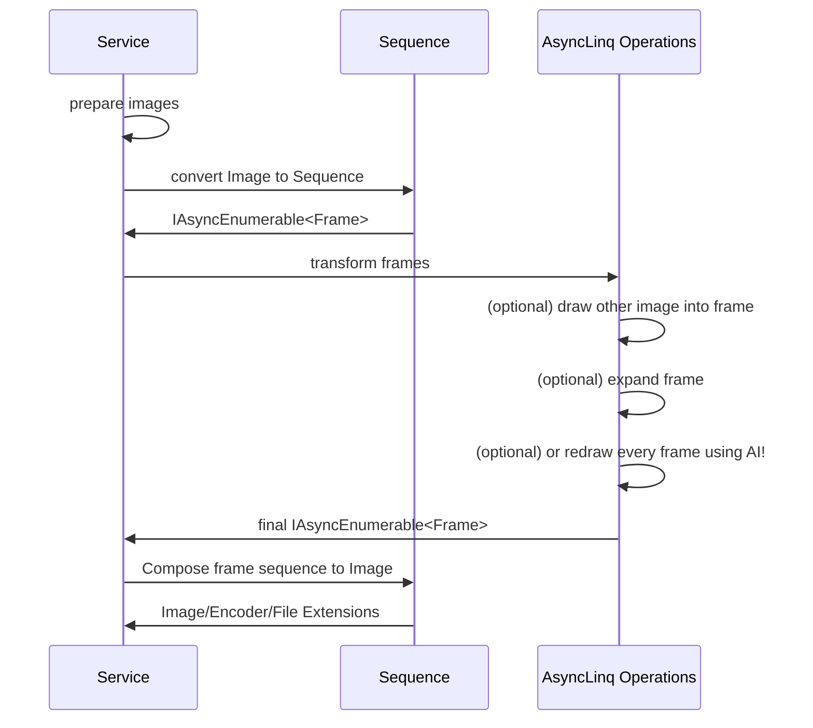

MemeFactory
----
A meme processing utility based on ImageSharp.

## Install
```xml
<PackageReference Include="MemeFactory.Core" Version="1.0.0-alpha.23" />
```
## Design


## Usage

```csharp
// load resources
using var baseImage = await Image.LoadAsync("resources/base.gif");
using var baseSequence = await baseImage.ExtractFrames()
    // the Sequence class can manage the disposal of all frames
    .ToSequenceAsync();

using var merry = await Image.LoadAsync("resources/merry.png");
using var punchSequence = await Frames
    .LoadFromFolderAsync("resources/punch")
    .DuplicateFrame(times: 1)
    .ToSequenceAsync();

// process
using var result = await baseSequence  // layer 0: base sequence
    // compose each frame with an image
    .EachFrame(Composers.Draw(merry, Resizer.Auto, Layout.LeftBottom))
    // compose two sequence frame by frame
    .FrameBasedZipSequence(punchSequence.LcmExpand(),
        Composers.Draw(Resizer.Auto, Layout.RightCenter))
     // rotate all frame
    .Rotation()
    // generate final image
    .AutoComposeAsync();

// output
await result.Image.SaveAsync(@"result." + result.Extension, result.Encoder);
```
